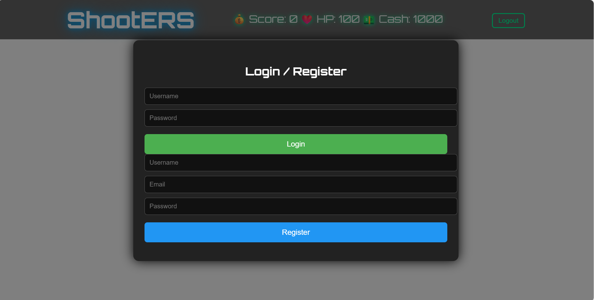
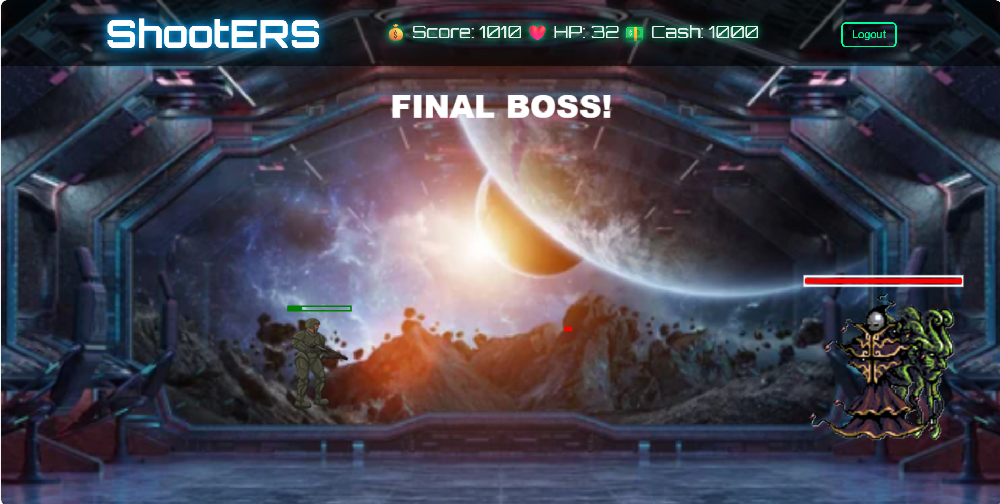

# ShootERS







**ShootERS** is a fast-paced browser-based 2D shooter game where the player battles waves of enemies, navigates portals, collects power-ups, and faces a formidable final boss. The game is built using vanilla JavaScript and HTML5 Canvas, featuring dynamic enemy behavior, collectible items, and a scoring system.

---

## Table of Contents

- [Gameplay](#gameplay)  
- [Features](#features)  
- [Installation](#installation)  
- [Controls](#controls)  
- [Assets](#assets)  
- [Game Mechanics](#game-mechanics)  
- [Score Saving](#score-saving)  
- [Testing](#testing)  
- [License](#license)  

---

## Gameplay

Players control a character that can move in all directions and shoot bullets. The objective is to:

1. Defeat waves of enemies spawned from portals.  
2. Collect power-ups and boosts to enhance abilities.  
3. Survive until the final boss appears and defeat it.  

Enemies vary in speed, health, and movement patterns. Strategic use of power-ups like **berserk**, **speed boost**, and **ignite** is crucial for success.

---

## Features

- **Dynamic enemy movement** – sinusoidal and aggressive patterns.  
- **Final boss** with unique charge attacks, shooting, and a death animation.  
- **Collectables** – health, berserk mode, score multipliers, speed boosts, and slowdown effects.  
- **Scoring system** – earn points for defeating enemies and destroying portals.  
- **Responsive canvas** – adjusts to window size dynamically.  
- **Bullet pooling** – optimized for performance during heavy combat.  
- **Victory and Game Over screens** – display score and save it online if logged in.  

---

## Installation

1. Clone the repository:

```bash
git clone https://github.com/yourusername/shooters-game.git
cd shooters-game
```

2. You must have dotnet v10 installed in your local system. Check the installed version:

```
dotnet --version
```

3. Create a database instance on SQL Server (Express) and add an appsettings.json file in the ShooteBackend folder with appropriate fields.

4. After cloning the repo to local, open a terimnal in the ShooterBackend folder and run the following commands:

```
dotnet build
```

```
dotnet run
```
This will start the server on your localhost.

5. Run the DDL script on your database to seed initial data (role,characters,etc.)

6. While the dotnet server is running, go to the frontend folder, you will find an index.html file.

7. Open this file on your localhost or via VS Code (Live Server).

NOTE : If you are opening html on a separate server, make sure to add the localhost url in the Program.cs file (Backend) under the CORS policy list.


## Controls

- **Move**: Arrow keys or W, A, S, D

- **Shoot**: Left-Click Mouse

- **Restart**: Ctrl+R

## Assets

- Character sprites

- Enemy sprites

- Bullet and projectile effects

- Background images and tiles

- Power-up icons

- Portal animations

- Boss sprites and effects

All assets are included in the assets/ folder.

## Game Mechanics

- **Portals**: Spawn enemies at intervals, increasing difficulty each wave.

- **Power-ups**: Temporary boosts or effects, e.g., faster shooting, double damage, speed.

- **Boss Fight**: Appears after a set number of waves; has multiple attack patterns.

- **Score Calculation**: Points are earned from defeating enemies, destroying portals, and collecting power-ups.

- **Victory Conditions**: Defeat the boss.

- **Game Over Conditions**: Player loses all health points.

## Demo

Not currently available

## Score Saving

- Scores are saved online if the player is logged in.

- New users must register and then log in before starting the game.

- High scores are updated only if the new score is higher than the previous one.

- JWT authentication ensures each score is tied to the correct user.